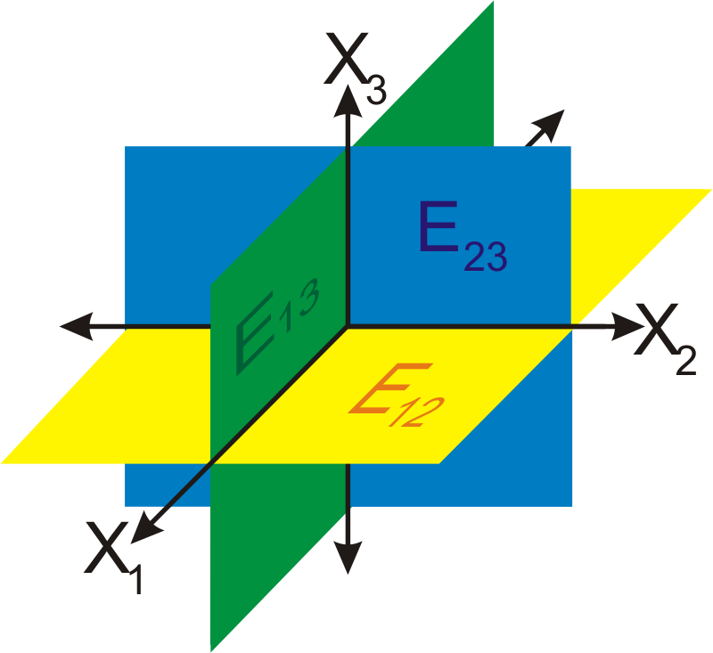
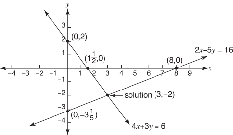
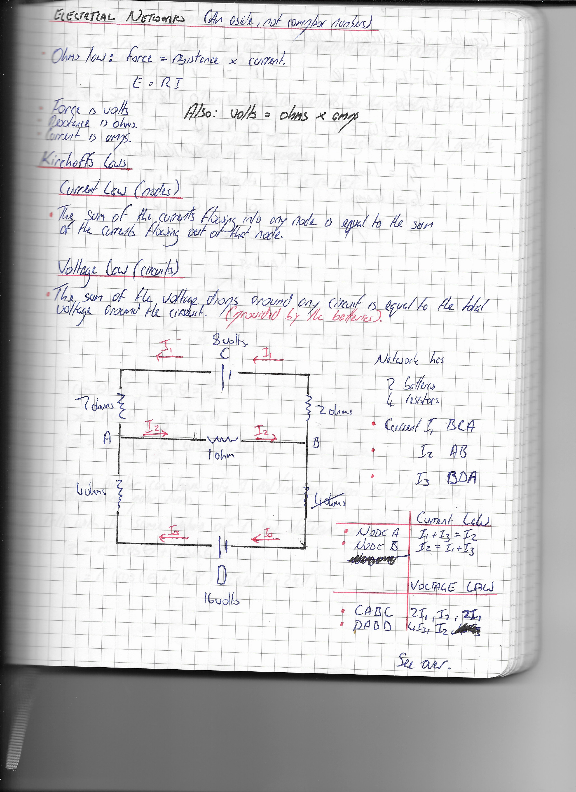
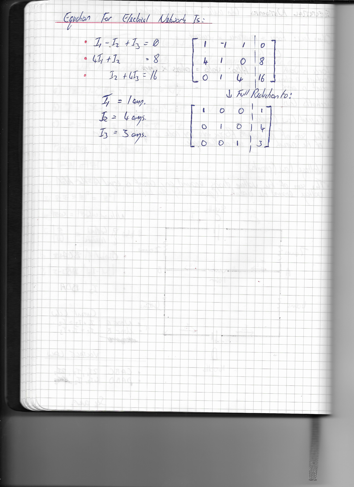
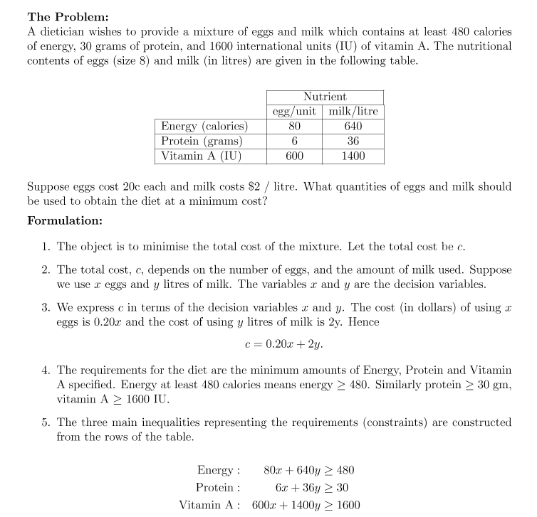
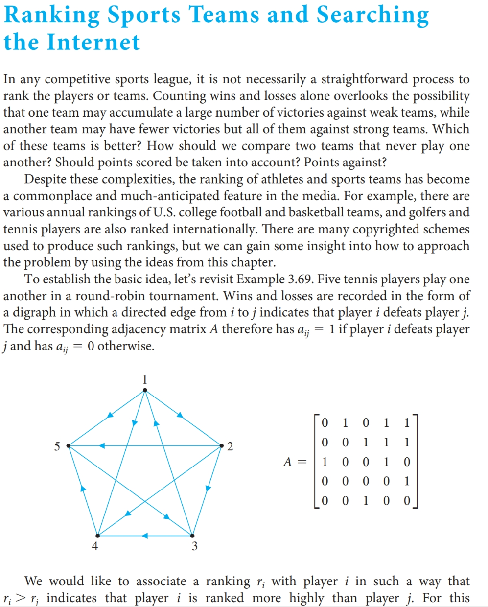
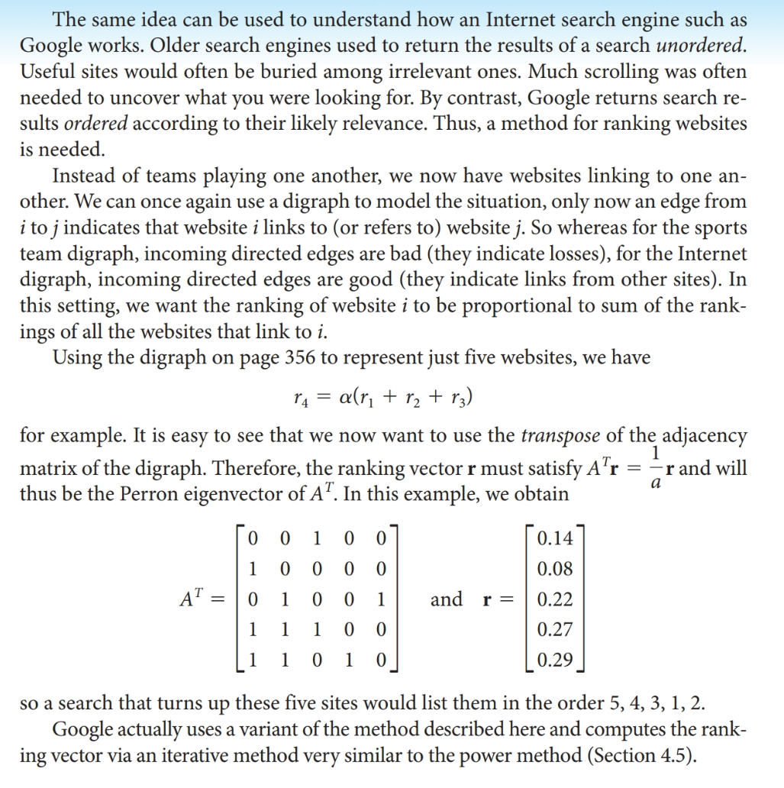
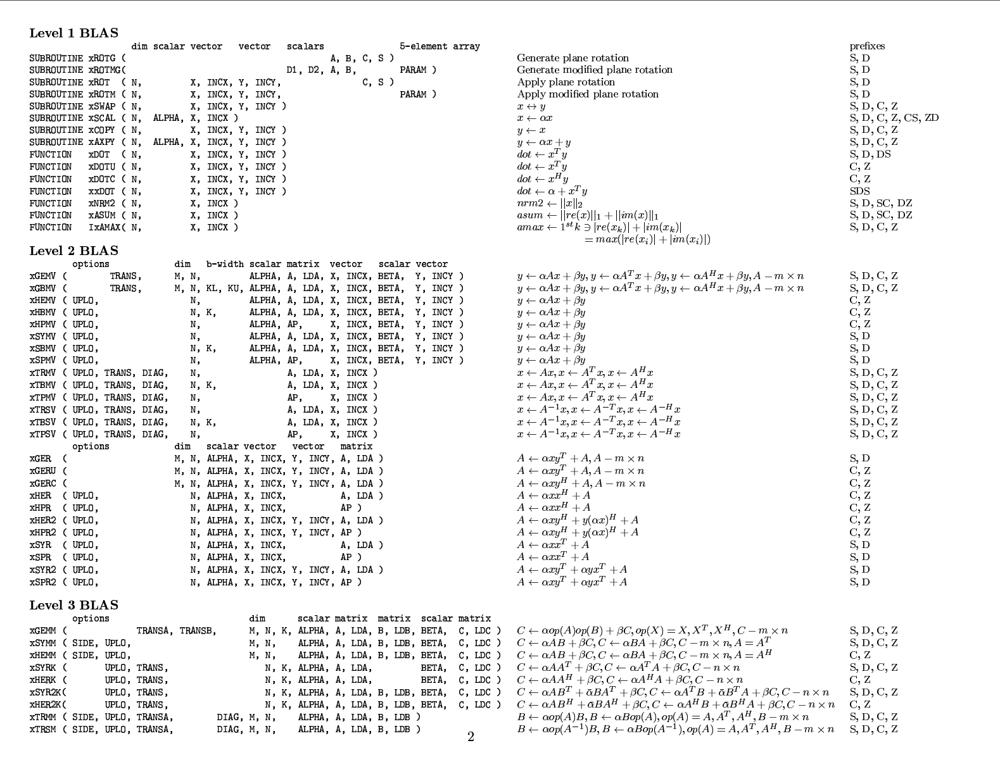

# Linear Algebra On The GPU

## What is Linear Algebra to me?

It's the abstraction of concepts from classic 2D and 3D geometry to 
allow them to be applied higher dimensions.  

---

## Formal Definition

A branch of mathematics that is concerned with mathematical structures closed 
under the operations of addition and scalar multiplication and that includes 
the theory of systems of linear equations, matrices, determinants, 
vector spaces, and linear transformations

---

## Applications

### Video Games

Games require a big bus to render 60fps back and forward. Some Linear Algebra Operations do not, its more of a batch approach.

---

### Circuit Analysis

---

### Optimisation
 
 
 - [Desmos Link Showing Geometric Solution](https://www.desmos.com/calculator/yn1p5unyoe)
 - [Google Chap Optimisation](https://jeremykun.com/2014/06/02/linear-programming-and-the-most-affordable-healthy-diet-part-1)

---

### Google Search Graph

 - 
 - 
 - [Google Search Ranking](https://jeremykun.com/2011/06/12/googles-pagerank-introduction/)
 - [Original Google Paper Stanford](http://infolab.stanford.edu/~backrub/google.html)

 *In this paper, we present Google, a prototype of a large-scale search engine which makes heavy use of the structure present in hypertext. Google is designed to crawl and index the Web efficiently and produce much more satisfying search results than existing systems.*

---

### Signal Processing 

The field of signal analysis gives one massively useful tools for encoding, analyzing, and manipulating “signals” that can be audio, images, video, or things like x-rays and light refracting through a crystal. 

---

## Linear Algebra Number Crunching

## BLAS

The BLAS (Basic Linear Algebra Subprograms) are routines that provide standard building blocks for performing basic vector and matrix operations. The Level 1 BLAS perform scalar, vector and vector-vector operations, the Level 2 BLAS perform matrix-vector operations, and the Level 3 BLAS perform matrix-matrix operations. Because the BLAS are efficient, portable, and widely available, they are commonly used in the development of high quality linear algebra software, LAPACK for example.

It originated as a Fortran library in 1979. Probably some of the most heavily optimized code on the planet.

Used By:

 - MATLAB
 - Mathmatica
 - NumPy
 - R
 - Julia

### API

## LAPACK

The 'high level' big brother.

LAPACK is written in Fortran 90 and provides routines for solving systems of simultaneous linear equations, least-squares solutions of linear systems of equations, eigenvalue problems, and singular value problems. The associated matrix factorizations (LU, Cholesky, QR, SVD, Schur, generalized Schur) are also provided, as are related computations such as reordering of the Schur factorizations and estimating condition numbers. Dense and banded matrices are handled, but not general sparse matrices. In all areas, similar functionality is provided for real and complex matrices, in both single and double precision.

LAPACK was originally written in FORTRAN 77, but moved to Fortran 90 in version 3.2 (2008)

## Implementations

Vendor | Standard | Library | Chip Set
------------ | -----------------------
AMD | BLAS | [Blis](https://developer.amd.com/amd-cpu-libraries/blas-library/) | Instinct
Apple | OpenCL 1.2 | [Apple Open CL](https://developer.apple.com/opencl) | AMD Vega 
Intel | BLAS | [Intel MKL](https://software.intel.com/en-us/mkl) | Intel x86
Nvidia | BLAS | [CUBLAS](https://developer.nvidia.com/cublas) | Tesla/Titan

[Nvidia General Purpose Solvers](https://developer.nvidia.com/cusolver)
[General Purpose Research Solvers](http://icl.cs.utk.edu/magma)

